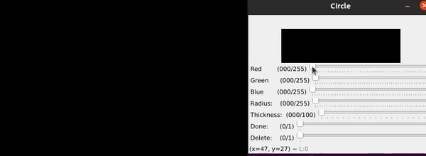
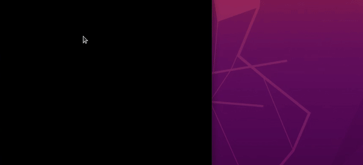

<h1> OpenCV Paint </h1>

<h2> Paint v1.0 </h2>

This program is created with Python, using <a href=’https://opencv.org/’> OpenCV </a> library. 

<h3> 1. Circle </h3>
<h3> 2. Rectangle </h3>
<h3> 3. Line </h3>
</h3> 4. Brush and smart line </h3>

<pre>

Color as well as thickness or radius can be changed with trackbars on window that will appear after pressing combination for the desired object. 

</pre>

<pre>
<h2><b>Circle</b></h2>

Combination for drawing a circle is <b>holding CTRL button and pressing middle button</b> here we want it to be the center of the circle. 

</pre>

<pre>
<h2><b>Rectangle</b></h2>

The combination to draw a rectangle is holding<b> SHIFT button and pressing middle button.</b>

First the coordinates of the upper left corner must be set, and then the bottom right corner.

</pre>

<pre>

<h2><b>Line</b></h2>

Combination for drawing a line is <b>holding ALT button and pressing middle button. </b> 

First press sets start coordinates and second press sets end coordinates of the line, after which new window will be created where we can change color, thickness or delete line. 

</pre>

<pre>

<h2><b>Brush and smart line</b> </h2>

To start drawing with brush just click on the image once, and start using it.

Smart line will link the initial and end coordinates of the line created with brush.

</pre>

