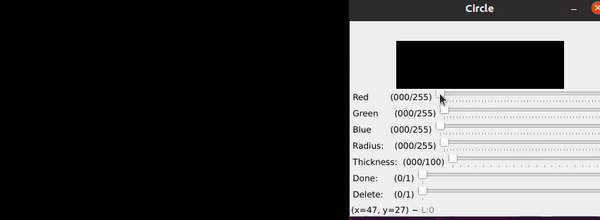

<h1> OpenCV Paint </h1>

<h2> Paint v1.0 </h2>

<h3>Circle </h3>
<h3>Rectangle </h3>
<h3>Line </h3>
<h3>Brush and smart line </h3>

<pre>

Color, thickness and radius can be changed with trackbars on window that appears after pressing combination for the desired shape. 

</pre>

<pre>
<h2><b>Circle</b></h2>

Combination for drawing a circle is <b>holding CTRL button and pressing middle button</b> to set up center of the circle. 

</pre>

<pre>
<h2><b>Rectangle</b></h2>

To draw a rectangle hold<b> SHIFT button and press middle button.</b>

Coordinates of the upper left corner must be set first, and then coordinates of the bottom right corner.

</pre>

<pre>

<h2><b>Line</b></h2>

Combination for drawing a line is <b>holding ALT button and pressing middle button. </b>

First press sets start coordinates and second press sets end coordinates of the line. 

</pre>

<pre>

<h2><b>Brush and smart line</b> </h2>

To start drawing with brush just click on the image once.

Smart line option links the initial and end coordinates of the line created with brush.

</pre>

